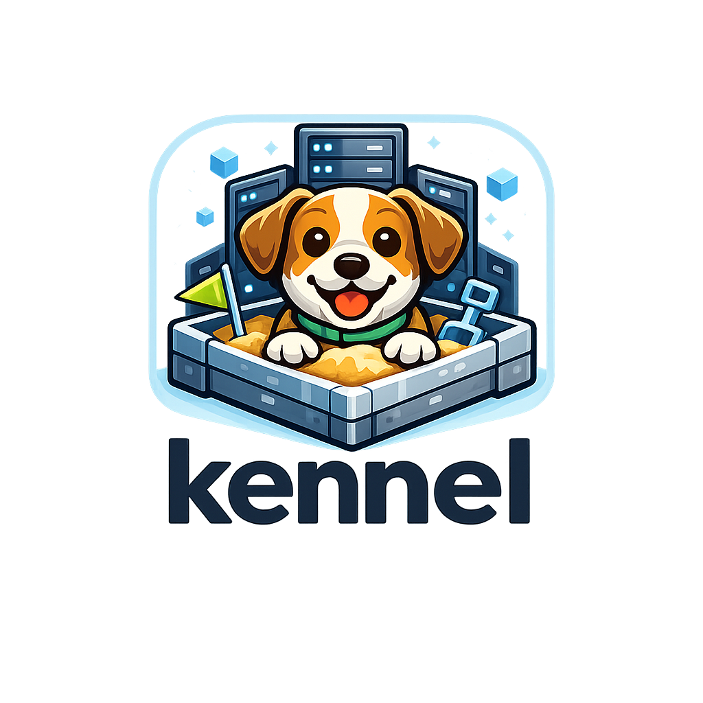

<p align="center">
  
</p>

<h1 align="center">kennel</h1>

<p align="center"><strong>Portable sandbox manager for AI coding agents.</strong></p>

`kennel` is a thin Go wrapper around Docker Desktop's
[Sandboxes](https://docs.docker.com/desktop/features/sandboxes/) feature. It
lets any project run an AI coding agent (Claude Code, Codex, Copilot, …)
inside an isolated VM with a deny-by-default firewall, without having to
maintain a project-specific fork of the same boilerplate.

Everything project-specific — the agent to run, the allow-listed hosts, extra
system packages, worktree layout, per-agent plugin repositories — lives in a
single `.kennel.yaml` at the project root. `kennel` discovers it the same way
`git` locates `.git/`: by walking upward from the working directory.

> **Status**: v0.1. The `.kennel.yaml` schema is considered stable across the
> 0.x line and will be formally frozen at 1.0.

---

## Why

Running Claude Code (or another agent) directly on your host machine means:

- Any `rm -rf`, `curl | sh`, or prompt injection has full filesystem and
  network reach.
- Installing per-project tooling pollutes the host environment.
- Parallelising work across branches requires either `git worktree` +
  manual tool setup or a heavy VM per branch.

Docker's `docker sandbox` fixes the isolation story, but a real team
workflow still needs: Dockerfile generation keyed off project config, a
reproducible allow-list of outbound hosts, worktree + sandbox pairing for
parallel branches, and first-run scaffolding. `kennel` packages those
concerns so every consuming project gets them for free.

---

## Requirements

- **Docker Desktop 4.58+** — provides the `docker sandbox …` command group.
- **Git** — used by the multi-env worktree commands.
- *(for `go install` / building from source)* **Go 1.22+**.

No other runtime dependencies. `kennel` ships as a single binary and shells
out to `docker` / `git`; there is no Python, no `yq`, no `jq`.

---

## Install

### Homebrew (once the tap is published)

```sh
brew install kentny/tap/kennel
```

### Go

```sh
go install github.com/kentny/kennel/cmd/kennel@latest
```

### From source

```sh
git clone https://github.com/kentny/kennel.git
cd kennel
make install PREFIX=$HOME/.local       # → ~/.local/bin/kennel
```

The source build stamps the binary's `kennel version` output via `ldflags`
using `git describe`, so installed builds report the exact commit they came
from.

---

## Quickstart

```sh
cd your-project
kennel init      # interactive TUI: arrow keys to move, SPACE to toggle, ENTER to confirm
kennel build     # generate a Dockerfile from .kennel.yaml and docker-build it
kennel run       # create sandbox, apply network policy, launch the agent
```

When you're done:

```sh
kennel rm        # delete the sandbox (the image stays cached)
```

Re-running `kennel run` against an existing sandbox is safe and idempotent:
network policy is re-applied on every invocation, so edits to
`.kennel.yaml`'s allow-list take effect without recreating the VM.

---

## Features

### Single-sandbox mode

One sandbox per project, created at `$(project-root)`. The whole project
directory is mounted into the sandbox at the same absolute path, so tool
config that references absolute paths (IDE settings, node_modules caches,
etc.) keeps working.

```sh
kennel build           # build the template image
kennel run             # create + apply network + launch
kennel bash            # debug shell inside the running sandbox
kennel rm              # delete the sandbox
kennel network apply   # re-push allow-list after editing .kennel.yaml
```

### Multi-environment mode

For parallelising work across branches. Each env is a
`git worktree` + `docker sandbox` pair, indexed by an integer `N` you
choose. The worktrees live under `worktree.parent` in the config
(`../{project}-wt/env-N` by default).

```sh
kennel env create 1 main                # worktree from existing branch
kennel env create 2 feature/x -b main   # new branch from main
kennel env start   1                    # launch env 1
kennel env bash    1                    # debug shell in env 1
kennel env stop    1                    # stop but keep worktree + sandbox
kennel env rebuild 1                    # recreate sandbox (keep worktree)
kennel env destroy 1                    # remove worktree AND sandbox
kennel env list                         # table of all envs + other worktrees
```

Architecture:

```
your-project/            ← main repo, env-0 (optional single-sandbox target)
../your-project-wt/
├── env-1/  ↔  docker sandbox: claude-your-project-1
├── env-2/  ↔  docker sandbox: claude-your-project-2
└── env-3/  ↔  docker sandbox: claude-your-project-3
```

Worktree parent, prefix, and template name are all config-driven — the
tokens `{project}`, `{agent}`, `{env}` are substituted at command time.

### Network policy (deny by default)

Every sandbox is launched behind `docker sandbox network proxy --policy
deny`. The allow-list is assembled from:

- `network.allow_hosts` / `network.allow_cidrs` — shared across all agents.
- `agents.<name>.allow_hosts` / `agents.<name>.allow_cidrs` — per-agent
  extras (e.g. `*.anthropic.com` only for claude).

Both lists are merged in declaration order with duplicates dropped. To push
a change without recreating the sandbox:

```sh
kennel network apply               # single-sandbox mode
kennel network apply --env 1       # env mode target
```

### Interactive `kennel init`

The init TUI walks through the fields most projects want to tune:

1. **Project name** — autodetected from `git remote origin url` or the
   directory basename; press Enter to accept or type a replacement.
2. **Default agent** — `claude`, `codex`, or `custom` (the last lets you
   write the agent name by hand afterwards).
3. **Network policy** — `deny` (recommended) or `allow` (full outbound).
4. **Allow-listed hosts** — a multi-select over a curated catalogue of ~30
   hosts, grouped by purpose (essentials, package registries, container
   registries, OS mirrors, cloud, build tools). The recommended subset is
   pre-checked.
5. **Claude plugins** — scanned from `~/.claude/plugins/installed_plugins.json`
   and joined against `~/.claude/plugins/known_marketplaces.json` so the git
   URL for each marketplace-backed plugin comes out automatically. All
   discovered plugins are pre-selected.

The TUI is implemented on [`charmbracelet/huh`](https://github.com/charmbracelet/huh)
so arrow keys, SPACE toggle, and ENTER confirm behave consistently across
Terminal.app, iTerm, tmux, and SSH sessions.

**Non-interactive invocations** (`--yes` / piped stdin / CI) use the
recommended defaults: `deny` policy, the catalogue's recommended hosts for
the chosen agent, and every discoverable Claude plugin included.

---

## Configuration

`.kennel.yaml` lives at the project root. `kennel` discovers it by walking
upward from the current working directory. All top-level keys except
`project.name` are optional; unknown keys are ignored so a newer `kennel`
can add fields without breaking older binaries.

Full annotated example:

```yaml
version: 1

project:
  name: your-project          # used in sandbox / template / worktree naming

default_agent: claude         # claude | codex | <custom-name>

worktree:
  parent: "../{project}-wt"   # tokens: {project}. Relative paths resolve against
                              # the config file's directory. `~` is expanded.

sandbox:
  template_name: "{project}-{agent}-sandbox"   # passed to `docker build -t`
  name_prefix:   "{agent}-{project}"           # sandbox name; env-mode appends `-<N>`

network:
  default_policy: deny
  allow_hosts:                # always allowed, regardless of agent
    - host.docker.internal
    - github.com
    - "*.githubusercontent.com"
    - "*.npmjs.org"
    - "*.pythonhosted.org"
  allow_cidrs:
    - 172.16.0.0/12           # Docker internal networks

agents:
  claude:
    # base_image: docker/sandbox-templates:claude-code    # built-in default
    plugins:
      enabled: true
      repos:
        - { url: https://github.com/kentny/everything-claude-code.git, path: everything-claude-code }
        - { url: https://github.com/thedotmack/claude-mem.git,         path: claude-mem }
    allow_hosts:              # merged on top of network.allow_hosts above
      - "*.anthropic.com"
      - platform.claude.com

  codex:
    # base_image: docker/sandbox-templates:codex-universal
    plugins:
      enabled: false
    allow_hosts:
      - api.openai.com
      - "*.openai.com"

# Extra apt packages installed at `kennel build` time.
apt_packages:
  - openjdk-21-jdk

# Environment variables exported by the sandbox persistent init script.
env:
  JAVA_HOME: /usr/lib/jvm/java-21-openjdk-amd64

# Extra shell lines appended verbatim to the init script. Good for source-ing
# runtime inits (nvm.sh, sdkman-init.sh). Avoid shell completion scripts —
# they break the Claude Code bash tool.
init_script: |
  export no_proxy="${no_proxy},172.17.0.1"

# Escape hatch for Dockerfile changes the declarative fields cannot express.
# Path is resolved relative to this file. Contents are appended verbatim to
# the generated Dockerfile as root, right before the final USER switch.
# dockerfile_extra: .kennel/Dockerfile.extra
```

### Token reference

Tokens are expanded in `sandbox.template_name`, `sandbox.name_prefix`, and
`worktree.parent`. Missing values leave the placeholder unresolved so the
failure mode surfaces at read time.

| Token       | Source                                                      |
| ----------- | ----------------------------------------------------------- |
| `{project}` | `project.name`                                              |
| `{agent}`   | `--agent` CLI flag, or `default_agent`, or `claude`         |
| `{env}`     | The `N` passed to `kennel env` commands; empty otherwise    |

### Built-in agent defaults

When `agents.<name>.base_image` is absent, these defaults apply:

| Agent   | Base image                                   |
| ------- | -------------------------------------------- |
| claude  | `docker/sandbox-templates:claude-code`       |
| codex   | `docker/sandbox-templates:codex-universal`   |
| *other* | `docker/sandbox-templates:claude-code`       |

---

## Command reference

| Command                                   | Purpose                                                    |
| ----------------------------------------- | ---------------------------------------------------------- |
| `kennel init`                             | Scaffold `.kennel.yaml` (interactive TUI or `--yes`)       |
| `kennel build`                            | Generate a Dockerfile from config, then `docker build`     |
| `kennel run [-- ARGS…]`                   | Create (or reuse) sandbox, apply network, run agent        |
| `kennel bash`                             | Interactive shell inside the running sandbox               |
| `kennel rm`                               | Delete the sandbox (image stays cached)                    |
| `kennel env create <N> <branch> [-b base]` | Add worktree + sandbox for env N                          |
| `kennel env start <N> [-- ARGS…]`         | Launch env N's sandbox                                     |
| `kennel env stop <N>`                     | Stop env N's sandbox                                       |
| `kennel env bash <N>`                     | Shell in env N's sandbox                                   |
| `kennel env rebuild <N>`                  | Recreate env N's sandbox (keep worktree)                   |
| `kennel env destroy <N>`                  | Remove worktree AND sandbox for env N                      |
| `kennel env list`                         | Table of managed envs + other worktrees                    |
| `kennel network apply [--env N]`          | Re-push deny-by-default allow-list to a sandbox            |
| `kennel version`                          | Print version, commit, build date                          |
| `kennel completion <shell>`               | Generate bash/zsh/fish/pwsh completion script              |

### Global flags

| Flag              | Effect                                                   |
| ----------------- | -------------------------------------------------------- |
| `--agent <name>`  | Override `default_agent` from the config for this run    |
| `--config <path>` | Use an explicit config file (skips upward search)        |

### Argument forwarding

`kennel run` and `kennel env start` accept an optional `--` followed by
agent-specific flags, which are forwarded to `docker sandbox run` as agent
arguments. Use this to pass flags like `--debug` to the agent inside the
sandbox:

```sh
kennel run -- --debug
kennel env start 1 -- --some-agent-flag value
```

Configured plugin directories (`agents.<name>.plugins.repos[*].path`) are
automatically forwarded as `--plugin-dir` arguments in the same slot.

---

## Dockerfile generation

`kennel build` produces a fresh Dockerfile from `.kennel.yaml` at build
time. The full shape is in `internal/sandbox/dockerfile.tmpl`; a
representative output for a claude-backed project with plugins and extra apt
packages:

```dockerfile
# Generated by kennel v0.1.0 — do not edit by hand.
# Source of truth: /path/to/.kennel.yaml
ARG BASE_IMAGE=docker/sandbox-templates:claude-code
FROM ${BASE_IMAGE}

ARG AGENT=claude
ARG INSTALL_PLUGINS=true

USER root

# apt packages from kennel config
RUN apt-get update && apt-get install -y \
    openjdk-21-jdk \
    && rm -rf /var/lib/apt/lists/*

COPY init.sh /etc/sandbox-persistent.sh
RUN chmod +x /etc/sandbox-persistent.sh

# Claude Code plugins from kennel config
RUN mkdir -p /opt/plugins && \
    git clone --depth 1 https://github.com/kentny/everything-claude-code.git /opt/plugins/everything-claude-code && \
    git clone --depth 1 https://github.com/thedotmack/claude-mem.git /opt/plugins/claude-mem

USER agent
RUN case "${AGENT}" in \
        claude) mkdir -p ~/.claude ;; \
        codex)  mkdir -p ~/.codex ;; \
        *)      mkdir -p "$HOME/.${AGENT}" ;; \
    esac
```

If your project needs something this template cannot express, point
`dockerfile_extra: path/to/snippet` at a file — its contents are appended
verbatim as root, before the final `USER agent` switch.

---

## Development

Local iteration:

```sh
make build         # ./kennel with git-describe version baked in
make test          # go test ./... (catalog / config / discover / sandbox)
make lint          # gofmt check + go vet
make fmt           # gofmt -w
make install PREFIX=$HOME/.local
```

Release iteration is driven by [`goreleaser`](https://goreleaser.com):

```sh
git tag v0.1.0
goreleaser release --clean
```

Cross-compile targets in `.goreleaser.yaml`: `darwin/{amd64,arm64}`,
`linux/{amd64,arm64}`.

### Project layout

```
kennel/
├── cmd/kennel/                    # entry point (main.go)
├── internal/
│   ├── cli/                       # cobra wiring — one file per subcommand
│   ├── config/                    # .kennel.yaml schema + loader + tokens
│   ├── sandbox/                   # Dockerfile generation + docker CLI wrappers
│   ├── env/                       # git worktree + sandbox pair lifecycle
│   ├── catalog/                   # curated allow-host catalogue
│   ├── discover/                  # ~/.claude / ~/.codex scanners
│   ├── tui/                       # huh wrappers + styled logger
│   ├── paths/                     # tilde + relative path resolution
│   └── version/                   # build-time version vars
├── legacy-bash/                   # v0.1 bash prototype, kept for reference
├── assets/                        # logo and other static assets
├── homebrew/kennel.rb             # Homebrew formula (pending tap publication)
├── .goreleaser.yaml               # release cross-compile config
└── Makefile                       # local dev targets
```

### Running tests

```sh
go test ./...                     # unit tests
go test ./... -run TestLoad       # filtered
go test ./... -cover              # coverage summary
```

Tests cover config parsing (schema validation, token expansion, agent merge,
init script composition), Claude plugin discovery, Codex skill enumeration,
host catalogue overlays, and Dockerfile golden rendering. Docker / git
integration tests are intentionally not automated — they're covered by
manual smoke runs against a real Docker Desktop.

---

## Troubleshooting

### `no .kennel.yaml found in … — run 'kennel init' to create one`

You're running `kennel` from outside a project that has been initialised.
Either `cd` into one, or pass `--config path/to/.kennel.yaml` explicitly.

### `sandbox with name X already exists`

`kennel run` is idempotent — if this error appears, you hit a case the
existence probe missed (e.g. a sandbox in a transitional state). Clean up
with `kennel rm` then re-run.

### `unknown flag: --plugin-dir`

Happens when running `docker sandbox run` manually. `--plugin-dir` is an
agent argument and must sit after `--`:

```sh
docker sandbox run <sandbox-name> -- --plugin-dir /opt/plugins/X
```

### `current directory is not inside a git worktree`

`kennel env *` commands shell out to `git worktree list` and need an actual
Git repo. Single-sandbox commands (`build` / `run` / `bash` / `rm`) do not
have this requirement.

---

## License

MIT — see [LICENSE](./LICENSE).
